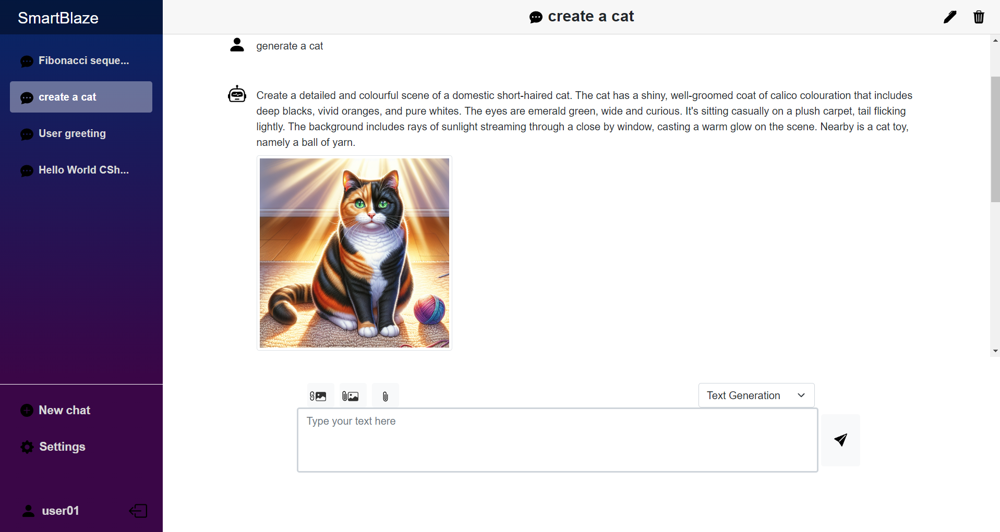

# SmartBlaze

**SmartBlaze** is an application designed to integrate with AI models such as OpenAI's ChatGPT and Google's Gemini. It was developed as part of the university thesis project, drawing inspiration from Chatbox (https://github.com/Bin-Huang/chatbox).
The application is built primarily using the C# programming language, with Blazor and ASP.NET Core frameworks forming the core of its architecture.

## Features and Capabilities

- **Interactive and smooth user interface** to manage multiple conversations with chatbots.
- **Customizable sessions**, allowing you to set system instructions to define chatbot behavior and adjust temperature to control the chatbot's creativity.
- **Wide selection of AI models** from OpenAI and Google Gemini, offering more options to choose from.
- **Text stream activation** for a more interactive conversation experience with the chatbot.
- **Code highlighting** for various programming languages, enhancing readability and presentation.
- **Image generation** capabilities using OpenAI's DALL-E models.
- **Image analysis** by the chatbot with the ability to add images for processing (image vision).
- **File upload** support, allowing the chatbot to access and analyze the contents of various types of files.
- **Cloud-based chat and configuration storage**, enabling you to resume conversations across multiple devices.

To use SmartBlaze, you'll need your own API key to interact with the chatbot models. You can obtain an API key from the AI model provider (OpenAI and Google).
